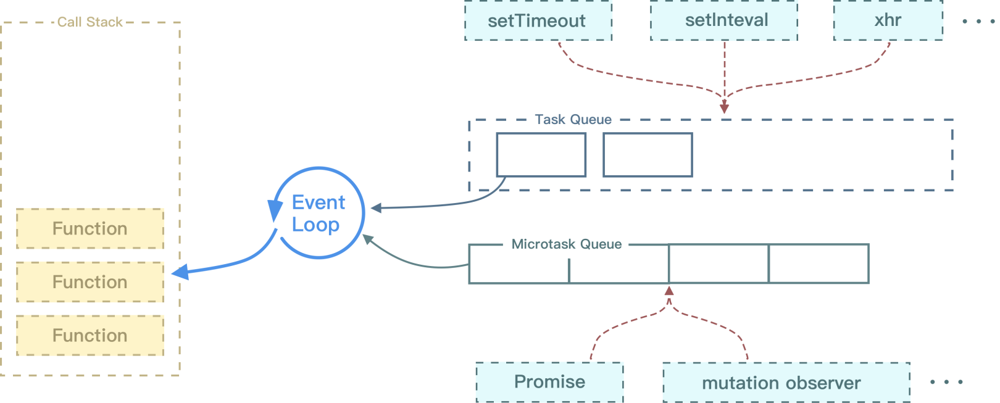
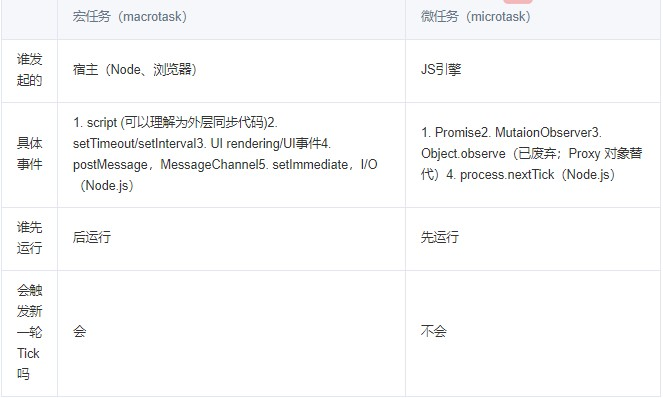

# 事件循环

### JS运行机制

1. JS是单线程执行
2. 宿主：JS的运行环境为node或浏览器
3. 执行栈：存储函数调用的栈结构，遵循先进后出原则

> ### Event Loop

JS引擎常驻内存中，等待宿主将JS或函数传递给它；也就是等待宿主环境分配宏任务、这种反复执行-等待称为事件循环；

> eventloop每一次的循环称为Tick，每一次的tick可分为：
1. 每次先执行最先进入执行栈的宏任务，直至同步代码执行完成
2. 检查是否有微任务，直至全部执行完成
3. 如果是浏览器环境，可能会渲染页面
4. 开始下一轮tick，执行宏任务中的异步代码（setTimeout等回调）

> ### 宏任务、微任务

1. 宏任务 marotask（task）： 由浏览器发起

2. 微任务 microtask（jobs）：由JS本身发起

> ### 参考链接
- [事件循环概念](https://juejin.cn/post/6844903657264136200)
- [事件循环实践链接](https://cloud.tencent.com/developer/article/1701427)

- [NodeJs事件循环](https://nodejs.org/en/docs/guides/event-loop-timers-and-nexttick/#process-nexttick)
- [深入理解事件循环](https://juejin.cn/post/6844903999506923528)

