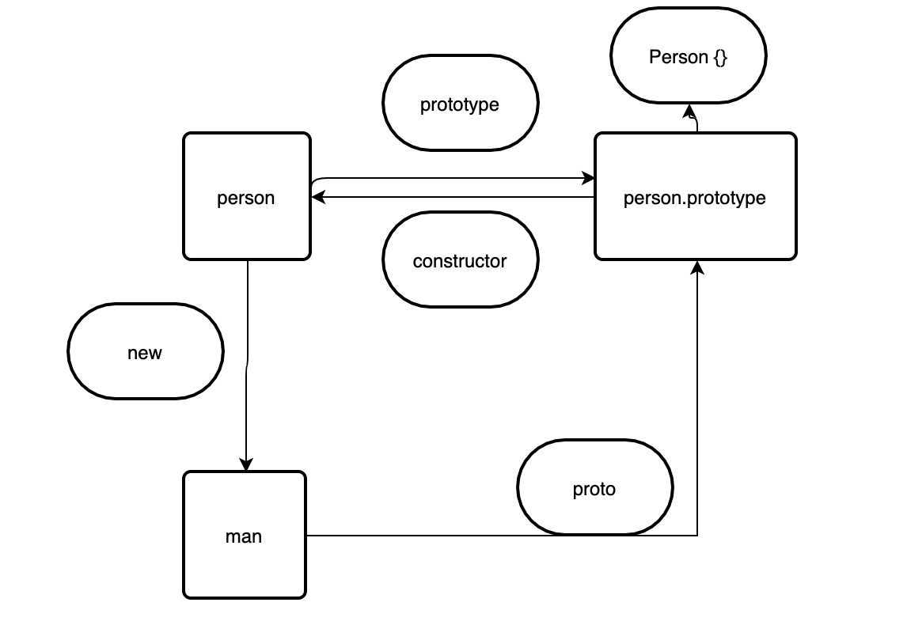

### JS 原型

> 在es6之前并没有类（[class](https://es6.ruanyifeng.com/#docs/class)）的概念，而es6的类也是es5原型及原型链的语法糖。值得理解的几个概念：

1. 万物皆对象，所有对象（如：内置对象）的原型属性最终都会指向Obejct的原型，例如：Math.__proto__ === Object.prototype
2. Function.prototype.__proto__ === Object.prototype，所有的内置对象都是Function的实例，Function原型的原型属性指向Object的原型，因此应证了第1点
3. 所有的原型的原型属性最后都指向空（null），Object.prototype.__proto__ === null
4. 既然类是原型及原型链的语法糖，那么就应该有类：封装、继承、多态的特性

> 理解原型首先从一张图、一段代码说起



```js
function Person(){ 
    ****
}
var man = new Person()
```
> 原型和原型属性的理解

- 只要创建构造函数就会生成一个prototype属性指向原型对象，prototype属性会带有一个constructor属性指向该构造函数的指针。
- 每个实例的原型属性__proto__指向原型对象的内部指针。
- 每个对象都有__proto__，只有函数才有prototype属性。
- 原型链查找是通过__proto__查找的，直到null为止。

> new 关键字
1. 实例化构造函数，创建一个空对象
2. 改变this的指向，将构造函数的属性和方法赋值给实例
3. 将原型属性指向构造函数的原型，并返回这个实例

> 创建对象的模式
1. 工厂模式
2. 构造函数模式
3. 原型模式
4. 组合使用构造函数和原型模式
5. 动态原型模式

> 实现继承的方式
1. 重写原型链实现的继承
2. 使用构造函数
3. 组合继承
4. 原型式继承
5. 寄生组合式继承
6. 寄生式继承
> (对比es6中的继承使用super关键字来实现)


### JS 设计模式

- [常见设计模式一](https://www.cnblogs.com/imwtr/p/9451129.html)
- [常见设计模式二](https://juejin.cn/post/6844903751870840839)